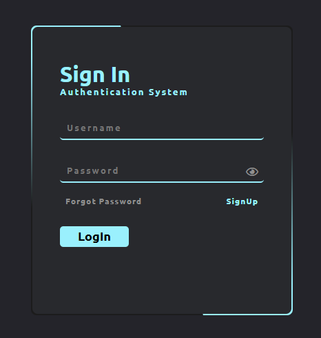
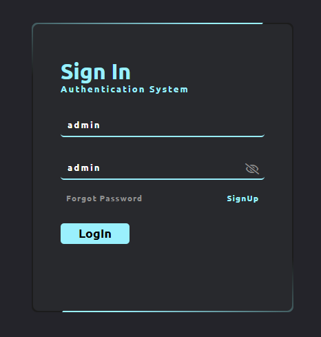

# 🌟 Animated Login

### 🎨 A Clean, Modern & Responsive Login Page Built with Pure HTML and CSS


## 🧩 Overview

**Animated Login** is a beautifully designed login interface that blends simplicity and animation for a delightful user experience.  
Built entirely with **HTML and CSS**, this page demonstrates how to achieve fluid animations, responsive layouts and modern UI styling — all without a single line of JavaScript!

Perfect for:
- 🚀 Web developers learning CSS animation
- 🎨 Designers building login screens
- 💼 Portfolios and landing pages


## ✨ Features

- ⚡ Lightweight and fast
- 📱 Fully responsive
- 🎬 Smooth hover and input animations
- 🌈 Easy to customize and extend
- 🖌️ Pure HTML & CSS — no frameworks needed


## 🖼️ Preview

**Animated Login Page**<br/>
<br/>



## 🧰 Requirements

To view or modify this project, you’ll need:

- 🌐 A modern web browser (Chrome, Edge, Firefox, Safari)
- 🧑‍💻 Any code editor (VS Code, Sublime Text, Atom)
- 💡 Basic understanding of HTML & CSS


## ⚙️ Installation Guide

Follow these steps to view the project locally:

```bash
# 1️. clone this repository
git clone https://github.com/iamx-ariful-islam/animated-login.git

# 2️. move into the project folder
cd animated-login

# 3️. open the index.html file in your browser
```


## 📂 Folder Structure
Here’s the structure of the **Animated Login** project:

```bash
animated-login/
│
├── screenshots/
├── index.html
├── LICENSE
├── README.md
└── styles.css
```
📝 Tip: You can freely modify colors, background gradients, or animation timings in `styles.css` to match your project’s branding.


## Contributing

Contributions, suggestions, and feedback are always welcome! ❤️
To contribute:

1. Fork the repository
2. Create a new branch (`feature/new-feature`)
3. Commit your changes
4. Push and submit a Pull Request

💬 You can also open an issue if you’d like to discuss a feature or report a bug.


## For more or connect with me

<p align='center'>
  <a href="https://github.com/iamx-ariful-islam"></a>&nbsp;&nbsp;&nbsp;&nbsp;
  <a href="https://x.com/mx_ariful_islam"></a>&nbsp;&nbsp;&nbsp;&nbsp;
  <a href="https://bd.linkedin.com/in/iamx-ariful-islam"></a>&nbsp;&nbsp;&nbsp;&nbsp;
  <a href="https://www.facebook.com/jonakisoft.net/"></a>&nbsp;&nbsp;&nbsp;&nbsp;
</p>


## License

The [MIT](https://choosealicense.com/licenses/mit/) License (MIT)


<h2 align="center">💖 Thank You for Visiting!</h2>

<p align="center">
  “Good design is about making things simple yet significant”<br>
  — <a href="https://github.com/iamx-ariful-islam" target="_blank"><strong>Md. Ariful Islam</strong></a>
</p>